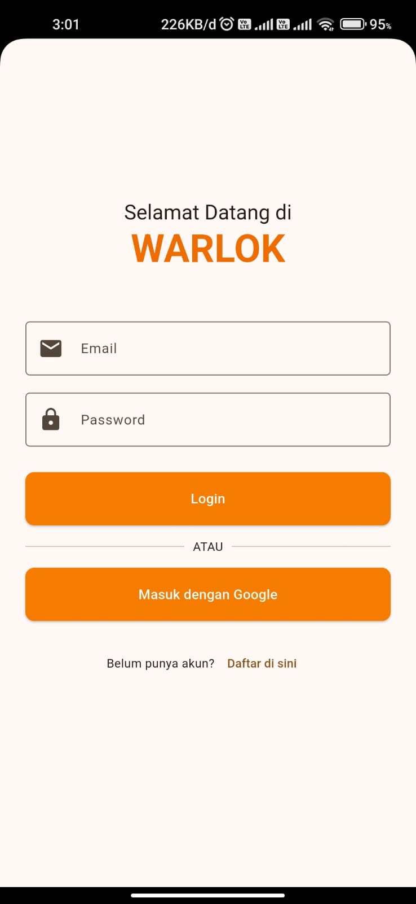
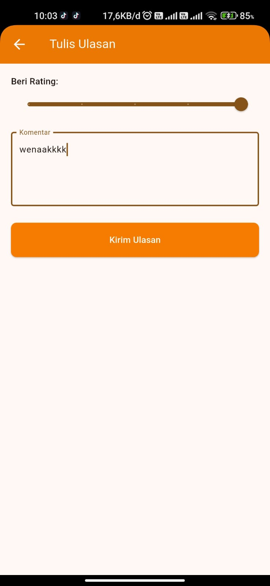
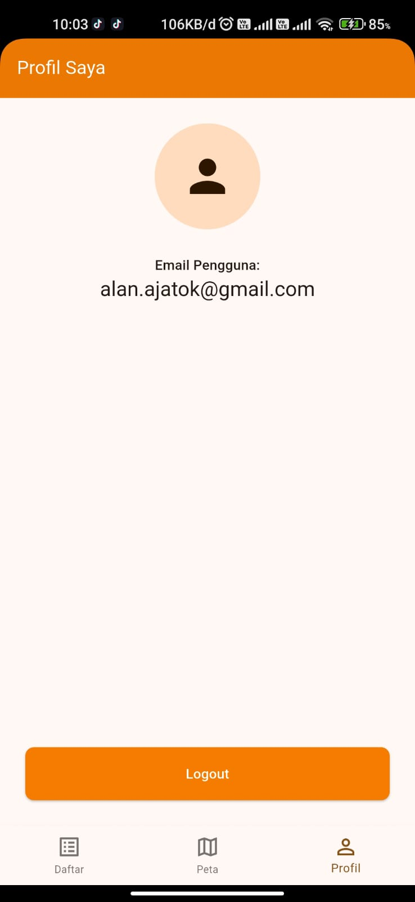

# WARLOK (Warung Lokal) 🍜

Sebuah aplikasi mobile berbasis Flutter yang dibangun sebagai platform komunitas untuk menemukan, berbagi, dan memberikan ulasan mengenai tempat makan lokal atau warung.

Link unutk download aplikasi : https://drive.google.com/file/d/1cuRfsQdUi2js4_30uwczVVsRsdhnxcGJ/view?usp=sharing

## Fitur Utama

-   **Otentikasi Pengguna:** Sistem pendaftaran dan login menggunakan Email/Password serta integrasi dengan Google Sign-In.
-   **Tampilan Data Ganda:** Pengguna dapat melihat daftar warung dalam format **List** yang informatif atau dalam format **Peta** yang interaktif.
-   **Fungsionalitas CRUD Penuh:** Pengguna yang sudah login dapat:
    -   **Create:** Menambahkan data warung baru, lengkap dengan nama, deskripsi, link gambar, dan pemilihan lokasi dari peta.
    -   **Read:** Melihat detail informasi warung.
    -   **Update:** Mengubah data warung yang pernah mereka tambahkan.
    -   **Delete:** Menghapus data warung yang mereka miliki.
-   **Sistem Ulasan & Rating:** Pengguna dapat memberikan ulasan berupa rating bintang dan komentar pada setiap warung.
-   **Fitur Berbasis Lokasi:** Aplikasi dapat meminta izin GPS dan menunjukkan lokasi pengguna di peta untuk mempermudah navigasi.
-   **Profil Pengguna:** Halaman untuk melihat info akun dan melakukan logout.
  
-   **NB:** untuk link gambar yang dimasukan berasal dari https://id.pinterest.com/ sesuaikan gambar yang ingin dimasukan ke dalam aplikasi, link yang di salin yaitu copy image addres contoh : https://i.pinimg.com/736x/e9/34/74/e9347425db4d58d7c4bd99d5dc576a0f.jpg.

---

## Teknologi & Arsitektur

Aplikasi ini dibangun dengan arsitektur **Feature-First** untuk memastikan kode tetap rapi, mudah dikelola, dan skalabel.

-   **Framework:** Flutter
-   **Bahasa:** Dart
-   **Backend:** Firebase (Backend-as-a-Service)
    -   **Firebase Authentication:** Untuk manajemen pengguna.
    -   **Cloud Firestore:** Sebagai database NoSQL real-time.
-   **Pustaka Pihak Ketiga Utama:**
    -   `flutter_map`: Menampilkan peta interaktif dari OpenStreetMap.
    * `google_sign_in`: Untuk proses otentikasi dengan akun Google.
    * `location`: Untuk mengecek status GPS dan meminta izin lokasi.

---

## Struktur Proyek

```
lib/
├── main.dart
├── core/
│   ├── services/
│   └── widgets/
└── features/
    ├── auth/
    │   ├── screens/
    │   └── services/
    ├── home/
    │   └── screens/
    ├── map/
    │   └── screens/
    ├── warung/
    │   ├── models/
    │   ├── screens/
    │   └── services/
    └── profile/
        └── screens/
```

---

## Panduan Setup & Instalasi

Untuk menjalankan proyek ini di komputermu, ikuti langkah-langkah berikut:

### 1. Prasyarat
-   Pastikan sudah menginstall [Flutter SDK](https://flutter.dev/docs/get-started/install).
-   Siapkan emulator Android atau perangkat Android fisik dengan mode developer aktif.
-   Install [Node.js](https://nodejs.org/) (diperlukan untuk Firebase CLI).

### 2. Konfigurasi Firebase
Proyek ini membutuhkan koneksi ke Firebase. Kamu harus membuat proyek Firebase-mu sendiri.

1.  **Buat Proyek Firebase:** Buka [Firebase Console](https://console.firebase.google.com/) dan buat proyek baru.
2.  **Aktifkan Layanan:** Di dalam proyek barumu, aktifkan layanan berikut:
    -   **Authentication:** Aktifkan sign-in method **Email/Password** dan **Google**.
    -   **Firestore Database:** Buat database dalam **Test Mode**.
3.  **Aktifkan Google Cloud API:** Buka [Google Cloud Console](https://console.cloud.google.com/), pilih proyekmu, dan aktifkan API berikut:
    -   `Identity Toolkit API`
    -   `Cloud Firestore API`
4.  **Daftarkan Aplikasi Android:**
    -   Kembali ke Firebase Console > Project Settings.
    -   Klik "Add app" dan pilih Android.
    -   Masukkan package name: `com.example.warlok`.
    -   Dapatkan **SHA-1 fingerprint** dari komputermu (`cd android` lalu `./gradlew signingReport`) dan tambahkan ke konfigurasi aplikasi Android di Firebase.
    -   Download file `google-services.json`.

### 3. Konfigurasi Proyek Lokal

1.  **Clone Repository:**
    ```bash
    git clone https://github.com/FAHMIALAN/WARLOK-APP.git
    cd warlok
    ```
2.  **Tempatkan File Konfigurasi:**
    -   Letakkan file `google-services.json` yang sudah kamu download ke dalam folder `android/app/`.
3.  **Perbarui `minSdkVersion`:**
    -   Buka file `android/app/build.gradle`.
    -   Ubah `minSdkVersion` menjadi `23`.
4.  **Install Dependensi:**
    ```bash
    flutter pub get
    ```
5.  **Hubungkan ke Firebase:**
    -   Pastikan kamu sudah menginstall Firebase CLI (`npm install -g firebase-tools`) dan FlutterFire CLI (`dart pub global activate flutterfire_cli`).
    -   Jalankan perintah ini dan pilih proyek Firebase yang sudah kamu buat:
        ```bash
        flutterfire configure
        ```
6.  **Jalankan Aplikasi:**
    ```bash
    flutter run
    ```
---

## Tampilan aplikasi

  
   
 
